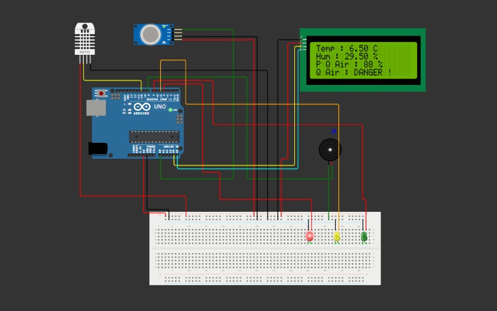

# Mini-projet-Surveillance-de-la-Qualit-de-l-Air

## Schéma de Câblage

## Code Source

Le code est disponible dans le dossier [main.cpp](main.cpp).

## Fonctionnalités Principales

### **Capteurs**

- **DHT22**  
  Mesure la température et l'humidité.
- **Capteur de gaz (MQ135)**  
  Détecte la pollution de l'air (valeur analogique convertie en pourcentage).

### **Affichage**

- **Écran LCD (I2C)**  
  Affiche :
  - Température
  - Humidité
  - Taux de pollution
  - Indicateur de qualité d'air (`Pur`, `Pollution`, `DANGER`)

### **Alertes Visuelles & Sonores**

- **LEDs (Vert/Jaune/Rouge)**  
  Indiquent le niveau de pollution :
  - Vert : Air pur
  - Jaune : Pollution modérée
  - Rouge : Pollution dangereuse
- **Buzzer**  
  Émet une alarme sonore en cas de pollution élevée.

### **Logique de Contrôle**

Classe la qualité de l'air en 4 niveaux :

1. **Pur** (valeur < 30%)
2. **Faible Pollution** (30% ≤ valeur < 60%)
3. **Forte Pollution** (60% ≤ valeur < 80%)
4. **DANGER !** (valeur ≥ 80%)
